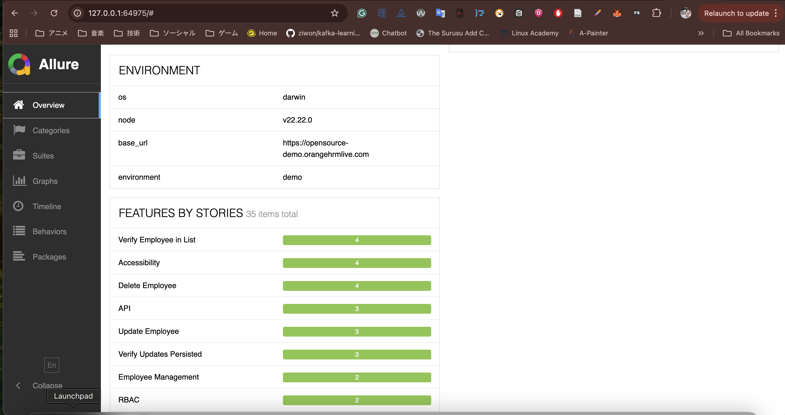
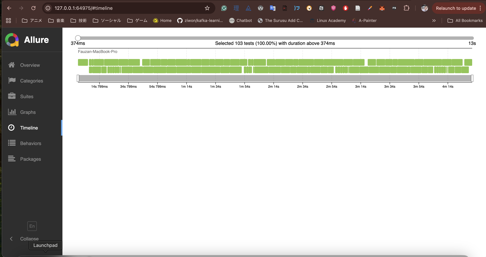
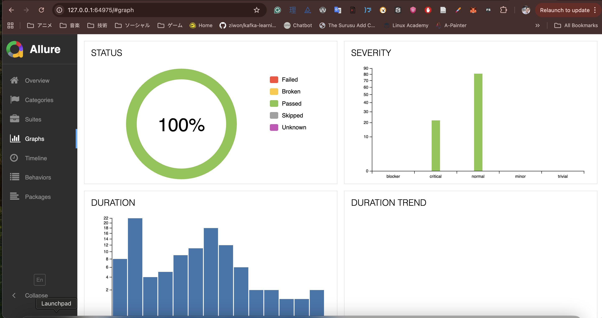
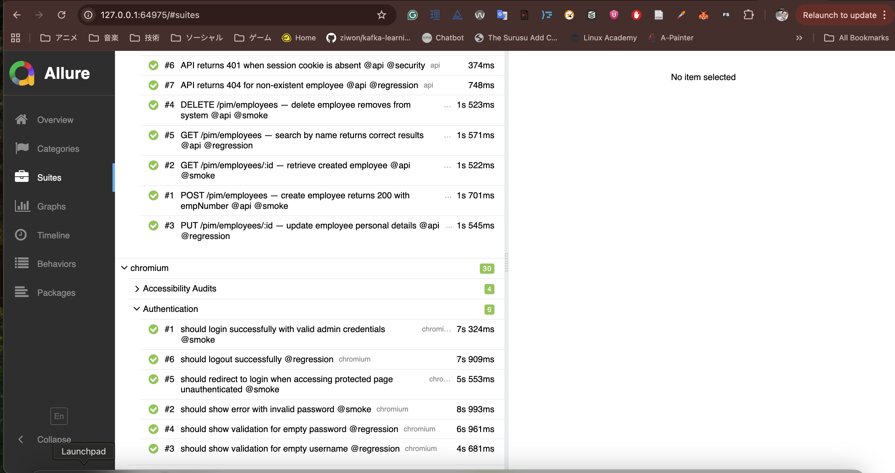

# OrangeHRM QA Automation Framework

> **Senior QA Automation Engineer — Technical Assessment**
> Playwright · TypeScript · Allure · K6 Performance · GitHub Actions CI/CD · Claude AI

[](https://github.com/favzqn/orangehrm-qa-automation/actions/workflows/ci.yml)

---

## Architecture Overview

```
orangehrm-qa-automation/
├── src/
│   ├── pages/                    # Page Object Models
│   │   ├── base.page.ts          #   → Smart wait wrappers, retry-aware interactions
│   │   ├── login.page.ts         #   → Authentication flows
│   │   ├── employee/             #   → Employee List, Add, Edit pages
│   │   └── admin/                #   → User Management / RBAC
│   ├── fixtures/
│   │   └── base.fixture.ts       # Playwright fixtures — DI for pages + utilities
│   ├── utils/
│   │   ├── api-client.ts         # OrangeHRM REST API v2 client
│   │   ├── test-data.ts          # Faker-based test data factory
│   │   ├── ai-helper.ts          # Claude AI — flaky detection, failure analysis
│   │   └── retry.ts              # Retry utilities with backoff strategies
│   └── config/
│       └── env.config.ts         # Environment-based configuration
├── tests/
│   ├── auth.setup.ts             # Playwright auth setup project
│   ├── e2e/
│   │   ├── auth/login.spec.ts    # Authentication tests
│   │   └── employee/
│   │       ├── employee-lifecycle.spec.ts  # Full Create→Update→Delete flow
│   │       └── employee-rbac.spec.ts       # Role-based access control
│   ├── api/
│   │   └── employee.api.spec.ts  # REST API contract tests
│   └── performance/
│       ├── login.k6.js           # K6: Login API load test
│       └── employee.k6.js        # K6: Employee CRUD load test
├── .github/workflows/
│   ├── ci.yml                    # Main CI: lint → parallel tests → allure report
│   └── performance.yml           # On-demand performance testing
├── scripts/
│   └── analyze-flaky.js          # AI-powered flaky test detector
├── playwright.config.ts
├── CLAUDE.md                     # Claude Code / AI integration guide
└── README.md
```

---

## Setup Instructions

### Prerequisites

| Tool | Version | Purpose |
|------|---------|---------|
| Node.js | ≥ 20 | Runtime |
| npm | ≥ 10 | Package manager |
| k6 | Latest | Performance tests (`brew install k6`) |
| Docker | Optional | Containerised execution |

### Local Install

```bash
# Clone and install
git clone https://github.com/favzqn/orangehrm-qa-automation
cd orangehrm-qa-automation
npm install                           # Also installs husky pre-commit hooks

# Install Playwright browsers
npx playwright install --with-deps

# Copy and configure environment
cp env.example .env
# (Optional) Add ANTHROPIC_API_KEY to .env for AI features
```

### Configure Environment

```bash
# .env (copy from env.example)
BASE_URL=https://opensource-demo.orangehrmlive.com
ADMIN_USER=Admin
ADMIN_PASSWORD=admin123
ANTHROPIC_API_KEY=your_key_here   # Optional: enables AI failure analysis
```

### Docker (zero local setup)

```bash
# Run smoke tests — no Node/Playwright install needed
docker-compose run smoke

# Run full regression
docker-compose run regression

# Run API tests only
docker-compose run api

# View Allure report at http://localhost:4040
docker-compose up allure
```

---

## Execution Steps

### Run All Tests

```bash
npm test                          # All tests, 2 workers (local)
npm run test:parallel             # 4 parallel workers
```

### Run by Category

```bash
npm run test:smoke                # Dedicated smoke project — tight timeouts, fast feedback
npm run test:regression           # Full suite @regression tag
npm run test:employee             # Employee domain only
npm run test:api                  # REST API contract tests (no browser)
npm run test:visual               # Visual regression snapshots
npm run test:a11y                 # WCAG 2.1 AA accessibility audits
```

### Run Specific Browser

```bash
npm run test:chromium
npm run test:firefox
npm run test:webkit
```

### Update Visual Baselines

```bash
npm run test:update-snapshots     # Regenerate baseline screenshots
```

### Debug Mode

```bash
HEADED=true npm test              # Show browser
SLOW_MO=500 HEADED=true npm test  # Slow motion
npx playwright test --debug       # Playwright Inspector
npx playwright test --ui          # Playwright UI Mode
```

### Allure Report

```bash
npm run report:generate           # Build Allure HTML report (with trend history)
npm run report:open               # Open in browser
```

### Performance Tests (requires k6)

```bash
npm run perf:login                # Login API — smoke/load/spike scenarios
npm run perf:employee             # Employee CRUD load test
npm run perf:all                  # Both
```

---

## CI/CD Pipeline

### GitHub Actions Workflow

```
push/PR → Code Quality → Parallel E2E (3 browsers × 4 shards = 12 jobs)
                      → API Tests
                      → Allure Report Generation → GitHub Pages
       (nightly only) → Performance Tests
       (on main only) → AI Flaky Test Analysis
```

### Pipeline Flow

```
push/PR
  └─ Lint & Typecheck
       ├─ Smoke Tests (chromium, fast gate)
       │    ├─ E2E Matrix (3 browsers × 4 shards = 12 parallel jobs)
       │    ├─ API Contract Tests
       │    ├─ Accessibility Audit
       │    └─ Visual Regression (PR + nightly only)
       └─ Allure Report (with history trend) → GitHub Pages
            └─ AI Flaky Analysis (main only)

nightly only:
  └─ K6 Performance Tests (login + employee)

on failure (main branch):
  └─ Slack notification with test breakdown
```

### Key Features

- **Matrix strategy:** 3 browsers × 4 shards = 12 parallel jobs
- **Fail-fast: false** — all browsers complete even if one fails
- **Smoke gate:** PR blocked if smoke fails, before full regression runs
- **Concurrency:** cancels in-progress runs on new push
- **Allure history:** previous run's history restored so trend charts work
- **Artifacts:** screenshots, videos, traces on failure (7-day retention)
- **Allure report** published to GitHub Pages on `main` merges
- **Slack notifications** on main branch failures
- **Nightly** full regression + performance tests at 2am UTC

### Required Secrets

| Secret | Required | Purpose |
|--------|----------|---------|
| `GITHUB_TOKEN` | Auto | GitHub Pages deployment |
| `ANTHROPIC_API_KEY` | Optional | AI failure analysis + flaky detection |
| `SLACK_WEBHOOK_URL` | Optional | Failure notifications |

---

## Claude Code Integration

This project is **Claude Code-native** — it ships with custom slash commands and MCP server
configuration for AI-assisted test development and debugging.

### Custom Slash Commands

Open the project in Claude Code and use these commands:

```
/generate-test Leave Management — apply and approve leave request
    → Generates a full Page Object + test spec for the Leave module

/analyze-failure employee-lifecycle
    → AI diagnoses the failure using screenshots + live DOM inspection

/heal-selectors src/pages/employee/
    → Finds broken locators and suggests resilient ARIA-based replacements

/run-smoke chromium
    → Runs @smoke suite and returns a structured pass/fail summary

/flaky-check employee-lifecycle --runs 5
    → Runs the test 5 times, detects instability, suggests fixes

/perf-report all --vus 20
    → Runs K6 scenarios and gives an AI-interpreted performance verdict

/inspect-app "add employee form"
    → Opens Chrome DevTools MCP to map form fields for POM generation

/coverage-report
    → Shows which OrangeHRM modules are tested and what gaps exist
```

### MCP Servers (`.claude/settings.json`)

| Server | Purpose |
|--------|---------|
| `chrome-devtools` | Live browser inspection, screenshots, DOM/network analysis |
| `playwright` | Direct Playwright browser control from Claude Code |
| `context7` | Inline Playwright/K6/Allure documentation |

### AI Features (requires `ANTHROPIC_API_KEY`)

| Feature | Model | Where |
|---------|-------|-------|
| Flaky test detection | Claude Opus 4.6 | `AITestHelper.detectFlakyTests()` |
| Failure analysis | Claude Sonnet 4.6 | `AITestHelper.analyzeFailure()` |
| Selector healing | Claude Haiku 4.5 | `AITestHelper.healSelector()` |
| Test data generation | Claude Haiku 4.5 | `AITestHelper.generateTestData()` |

---

## Key Design Decisions

### 1. Global Auth with Storage State
Instead of logging in on every test (slow, flaky), a dedicated `auth.setup.ts` project
authenticates once and saves the browser storage state to `src/.auth/admin.json`.
All subsequent tests reuse this state — **login runs exactly once per worker**.

### 2. API-First Cleanup
Test data created via UI is cleaned up via the API after each test using the `empCleanup`
fixture. This is faster and more reliable than UI-based deletion, and prevents data
accumulation across runs.

### 3. Fixture-Based Dependency Injection
All Page Objects, API clients, and utilities are injected via Playwright's fixture system.
Tests never instantiate dependencies directly. This enables:
- Easy mocking in unit tests
- Consistent initialization
- Automatic resource cleanup

### 4. ARIA-First Locator Strategy
Locators use `getByRole()`, `getByLabel()`, and `getByText()` over CSS selectors.
Benefits:
- Resilient to CSS/class name changes
- Tests accessibility as a side effect
- More readable and maintainable

### 5. AI-Powered Flaky Detection
Test run history is fed to Claude Opus after each main branch merge. Claude identifies:
- **Intermittent failures**: random without pattern
- **Timing-sensitive**: pass/fail correlates with test order
- **Environment-dependent**: fail in CI but pass locally
- **Data-dependent**: fail when specific test data is present

### 6. Performance Threshold Enforcement
K6 thresholds are enforced as pass/fail gates:
- `p(95) < 2000ms` — 95th percentile response time
- `error_rate < 1%` — maximum tolerable error rate
- CI fails if thresholds are breached

### 7. Parallel Test Isolation
`TestDataFactory` prefixes all generated names with `W{workerIndex}{timestamp}` to
prevent collisions when multiple shards create employees simultaneously.

---

## Test Coverage

| Area | Tests | Tags |
|------|-------|------|
| Authentication | 6 | @smoke, @regression |
| Employee Lifecycle | 7 | @smoke, @regression, @employee |
| Role-Based Access | 4 | @rbac, @regression |
| API Contract | 7 | @api, @smoke, @security |
| Accessibility (axe) | 4 pages | @a11y |
| Visual Regression | 4 snapshots | @visual |
| Performance (K6) | 2 scenarios | Login + Employee CRUD |

---

## Flaky Test Mitigation

| Pattern | Solution |
|---------|----------|
| Spinner blocking interactions | `waitForPageReady()` waits for `.oxd-loading-spinner` to hide |
| Element not yet in DOM | `waitFor({ state: 'visible' })` before every interaction |
| Input value not applied | `smartFill()` verifies value after fill, retypes if needed |
| Parallel data collision | Worker-indexed unique names (`W0`, `W1`, ...) |
| Auth state corruption | Global auth saved once, not per-test |
| Leftover data from prior run | `empCleanup` fixture deletes via API after every test |
| Network timeouts | `retryOnNetworkError()` utility with exponential backoff |

---

## Test Results

> Full run: **103 tests passing** across 7 suites (chromium · firefox · webkit · smoke · api · visual · setup) in ~4m 31s

### Allure Report — Overview


### Graphs — 100% Pass Rate, Severity Distribution


### Suites — Test Hierarchy with Tags


### Environment & Feature Coverage


### Timeline — Parallel Execution Across Workers


---

## Reporting

Reports are generated in `reports/`:

| Report | Location | Description |
|--------|----------|-------------|
| Allure HTML | `allure-report/` | Rich interactive test report |
| Playwright HTML | `reports/html/` | Built-in Playwright report |
| JSON Results | `reports/results.json` | Machine-readable for CI |
| K6 Login | `reports/performance/login-report.html` | Login API perf report |
| K6 Employee | `reports/performance/employee-report.html` | Employee API perf report |
| Flaky Analysis | `reports/flaky-analysis.json` | AI flaky test analysis |

Screenshots, videos, and traces are captured automatically on test failure.

---

## Contact

Submitted by: **Fauzan**
Repository: [github.com/favzqn/orangehrm-qa-automation](https://github.com/favzqn/orangehrm-qa-automation)
